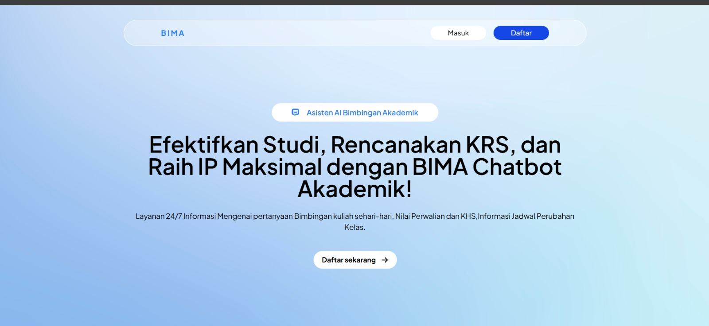
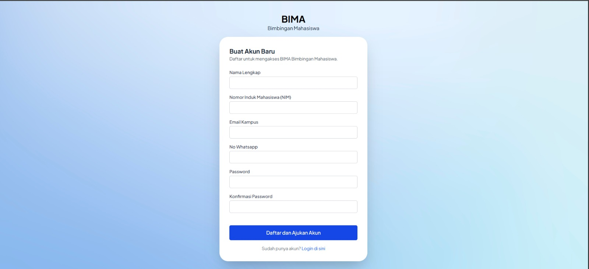
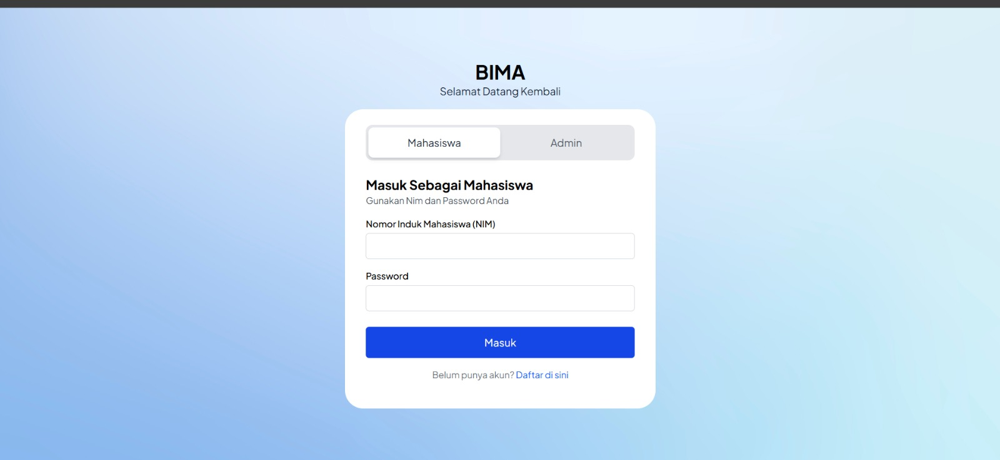
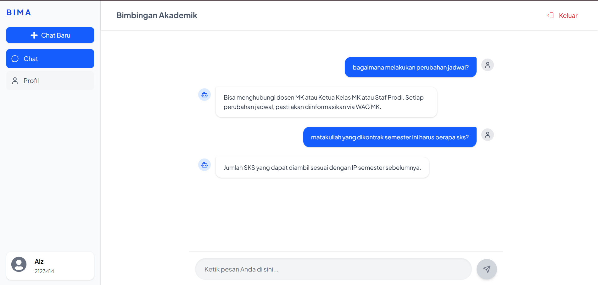
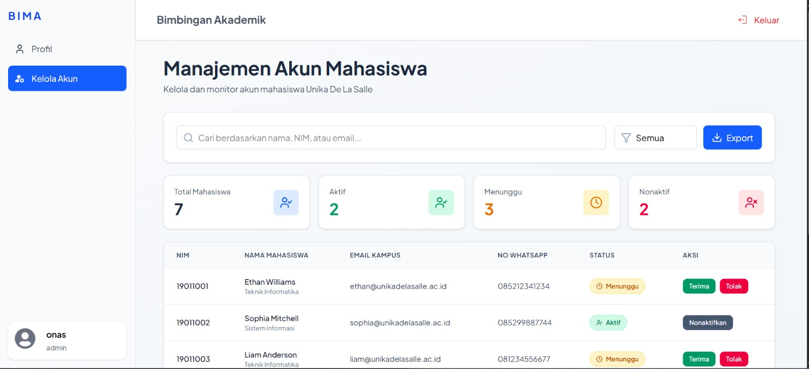
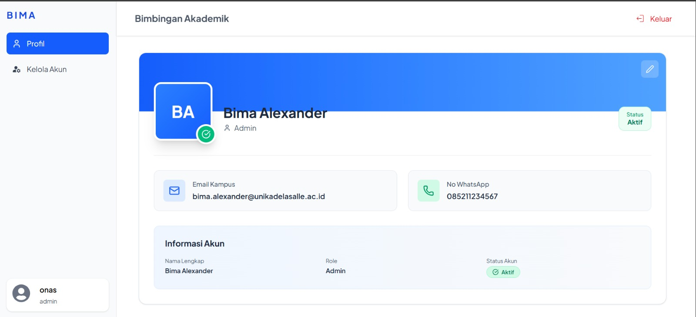
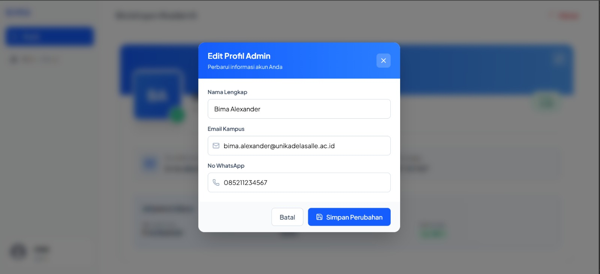
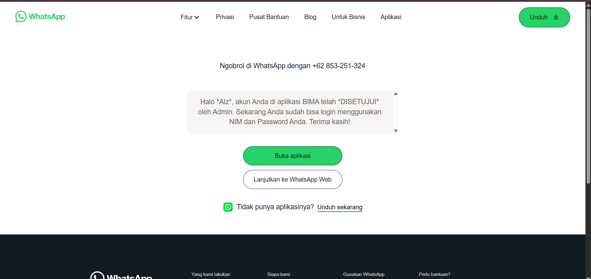
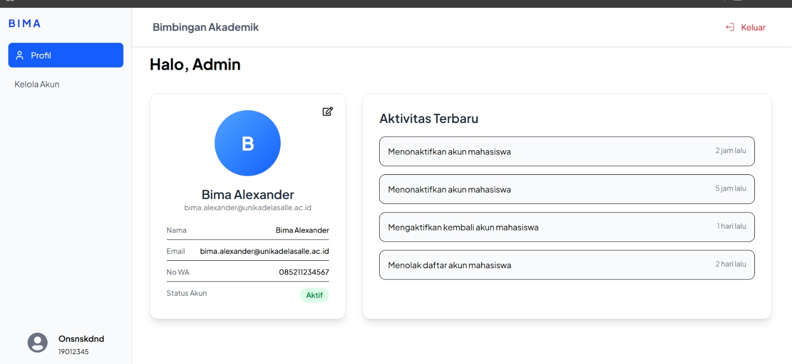

# Chatbot Pembimbing Akademik Berbasis Web (Naive Bayes)

Proyek ini merupakan aplikasi web yang berperan sebagai pembimbing akademik bagi mahasiswa

Aplikasi ini merupakan chatbot pembimbing akademik berbasis web yang menggunakan algoritma Naive Bayes untuk membantu mahasiswa memperoleh informasi akademik secara cepat tanpa harus melakukan konsultasi langsung.
Proyek ini dibuat untuk meningkatkan efisiensi proses bimbingan akademik, mengurangi antrean konsultasi, serta mempermudah mahasiswa mendapatkan jawaban awal terkait pertanyaan akademik yang umum diajukan.

## Latar Belakang

Proses bimbingan akademik yang dilakukan secara langsung atau melalui pesan pribadi (misalnya WhatsApp) sering menimbulkan beberapa kendala:

- Waktu respon dosen terbatas karena banyaknya mahasiswa
- Pertanyaan yang berulang dari mahasiswa yang berbeda
- Kesulitan dokumentasi dan pencarian riwayat konsultasi
  Dengan chatbot akademik ini, mahasiswa dapat memperoleh respon awal secara otomatis, sementara dosen dapat lebih fokus pada kasus yang membutuhkan pendampingan khusus.

## Fitur Utama

Admin:

- Verifikasi pendaftaran akun mahasiswa
- Manajemen akun pengguna
- Membuka WhatsApp intent otomatis setelah proses verifikasi akun sehingga admin dapat langsung mengirim pesan aktivasi ke nomor mahasiswa terkait

Mahasiswa:

- Registrasi akun
- Mengajukan pertanyaan melalui chatbot akademik

## Tech Stack

### Frontend


### Backend


### Database


### Tools


## Instalasi

1. Clone Repository

```
git clone https://github.com/JonathanAlzndr/chatbot-v1.git
cd chatbot-v1
```

2. Setup Backend (Flask)

```
# masuk ke folder backend
cd be

# membuat virtual environment (Windows)
python -m venv venv

# aktivasi virtual environment
venv\Scripts\activate

# install dependencies
pip install -r requirements.txt
```

Selanjutnya, siapkan database MariaDB dan buat file .env untuk menghubungkan backend dengan database.
Jalankan Server Backend:

```
flask run
```

3. Setup Frontend

```
# masuk ke folder frontend
cd ../fe

# install dependencies
npm install

# jalankan aplikasi
npm run dev
```

## 📸 Screenshots

### User (Mahasiswa)
<table>
  <tr>
    <td align="center"><b>Landing Page</b></td>
    <td align="center"><b>Register</b></td>
  </tr>
  <tr>
    <td></td>
    <td></td>
  </tr>
  <tr>
    <td align="center"><b>Login</b></td>
    <td align="center"><b>Chatbot</b></td>
  </tr>
  <tr>
    <td></td>
    <td></td>
  </tr>
</table>

### Admin
<table>
  <tr>
    <td align="center"><b>Dashboard</b></td>
    <td align="center"><b>Profil Admin</b></td>
  </tr>
  <tr>
    <td></td>
    <td></td>
  </tr>
  <tr>
    <td align="center"><b>Edit Profil</b></td>
    <td align="center"><b>Verifikasi Akun</b></td>
  </tr>
  <tr>
    <td></td>
    <td></td>
  </tr>
  <tr>
    <td align="center"><b>Kelola Akun</b></td>
    <td></td>
  </tr>
  <tr>
    <td></td>
    <td></td>
  </tr>
</table>

## Contributors:

- [Jonathan Alezandro](https://github.com/JonathanAlzndr) (Backend Developer)
- [Daniel Warouw](https://github.com/Niel-D22) (Frontend Developer)
